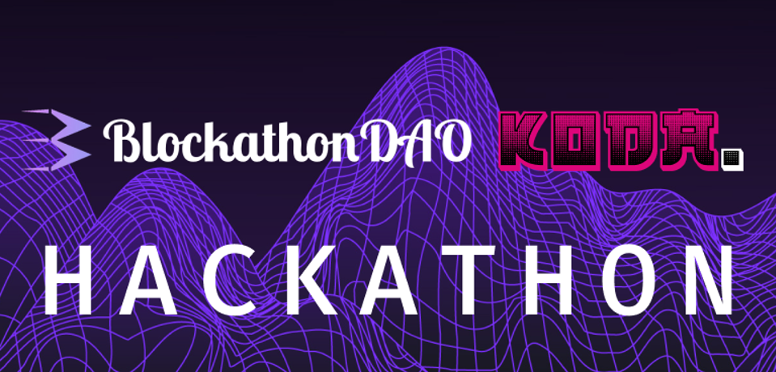

# Blockathon DAO & KodaDot 

- [All info is being constantly updated on BlockathonDAO twitter](https://twitter.com/Blockathon_DAO)

- [Further coordination and general info can be found on BlockathonDAO discord!](https://discord.gg/DZK5VMXnb7)

## Welcome on KodaDot fellow h4ck0r

- This page will serve as an easy overview over our documentation and flow we use

- All participants looking to tackle issues in KodaDot repository follow few simple steps:

### [Code of conduct](https://github.com/kodadot/nft-gallery/blob/main/CODE_OF_CONDUCT.md)

### [First time tackling issues at KodaDot](https://github.com/kodadot/nft-gallery/blob/main/FIRST_TIME.md)

### [Contributing - system, rewards, dynamics](https://github.com/kodadot/nft-gallery/blob/main/CONTRIBUTING.md)

## Submission form

**Great! It looks like you are ready to build. We kindly ask you to [fill out this form](https://form.kodadot.xyz/blockathon), so we can collect some information about you, e.g. ksm adress, discord nick, twitter etc.**

## Coordination and communication

- We kindly [invite you to our discord server](https://discord.gg/nq7jAWW87c), where coordination and further info can be provided. Ping **@damsky or @xylodrone** if you need any help. 

- KodaDot team is also hanging out on BlockathoDAO discord.