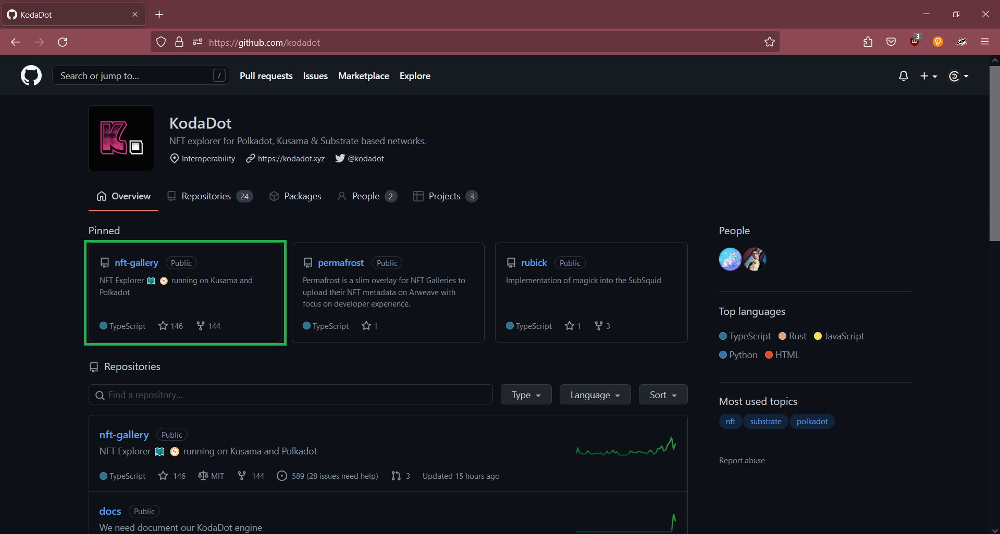
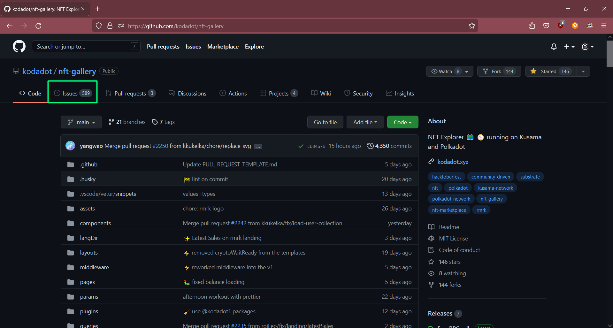

# How to file a proper bug report

- After you read the [code of conduct](https://github.com/kodadot/nft-gallery/blob/main/CODE_OF_CONDUCT.md) head to [KodaDot github](https://github.com/kodadot) and click on nft gallery

- You'll appear on nft gallery repository, where you need to click on "Issues"

- Once you are on the Issues page, click on "New issue"

- Choose "Bug report" by clickcing on "Get started"

