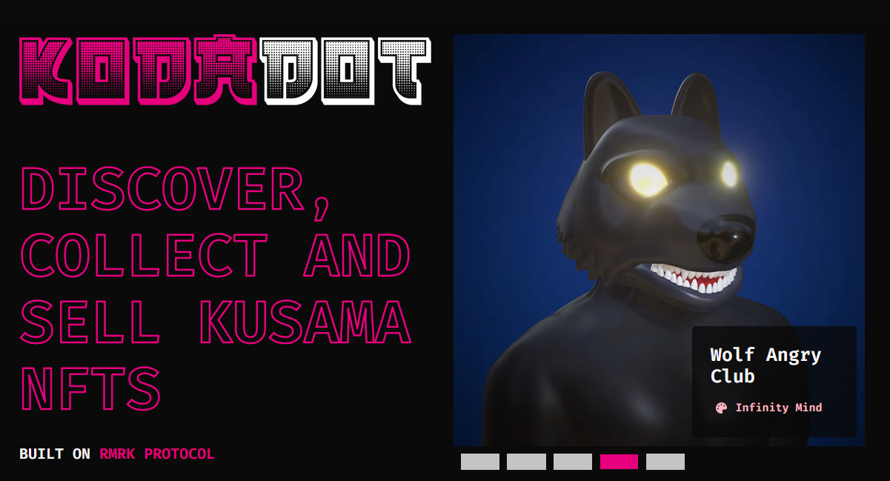

# How can you be featured on KodaDot?

 ## Thesis

 We are all artists in its way. It is our deep intention  to support artists and starting collections either in form of grant or by being spotlighted on our discord and also on the kodadot.xyz landing page.

 By being spotlighted on our discord, creators and collectors get direct contact with you and a lot of stuff can flourish just from that as well as collectors can catch up on your recent updates and new drops.

 Artists shape the community as well as collectors. We want to to keep this flowing hence we decided to give chance to high quality artists and collections.

 The main point is to shine light on active individuals in the space whose project is heading into long-term direction. As stated already in these docs, our values lie in long term plays rather than short term speculation. Simply bringing value to everyone in the space is what we are trying to achieve as we also could be called a common-good project.

 ## Pros

 As everyone in the space has their own purpose, KodaDot, as a common-good project is open to everyone. We have creators, artists, collaborators, collectors, biohackers. You can find many individuals under KodaDot roof and nurture many great opportunities

 Simply by being able to connect with other creators or even your people who just bought an art from you, we try to keep everything under one roof. Why?

 It's simple. Reaching out to your fans and community can be sometimes frustrating and time consuming. That's why we came up with spotlight possibility for active creators and artists.

 ## Spotlight

 Spotlight is a dedicated category on our [discord](https://discord.gg/kodadot) where the most active and high quality projects recieve their chance to connect with the rest of the community and share news and mints more exclusively. It's right at the top so it definitely gets the much needed attention.

 Newly, spotlighted artists are also visible on the main page.

 

 ## Would you like to get featured on the main KodaDot landing page?

 Find out more on our discord! Looking forward for your introduction it the dedicated channel.
