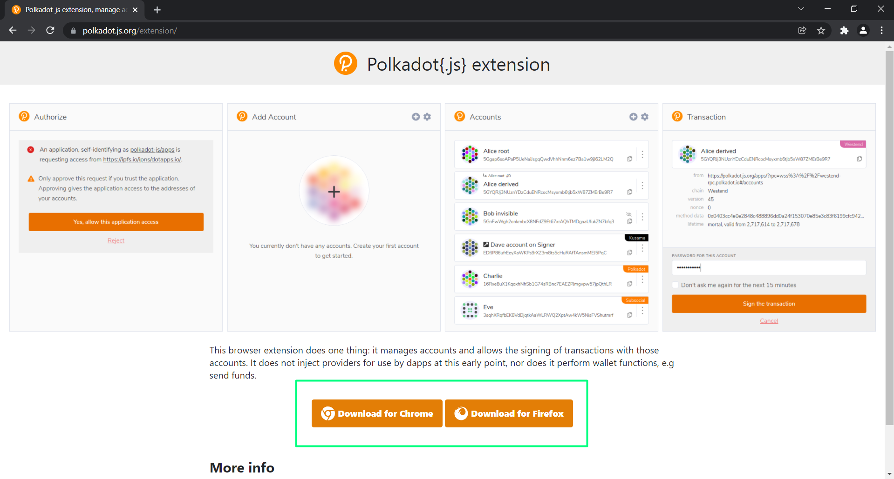
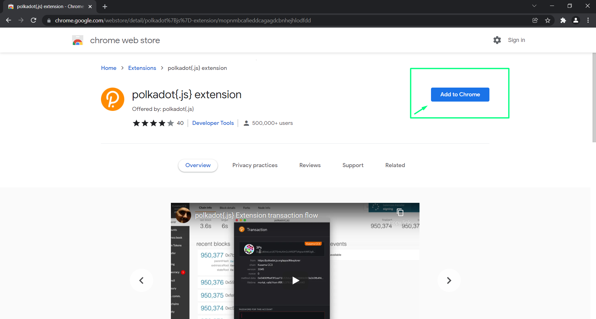
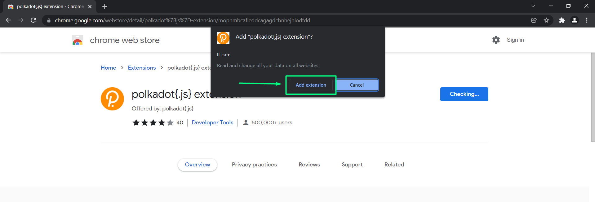
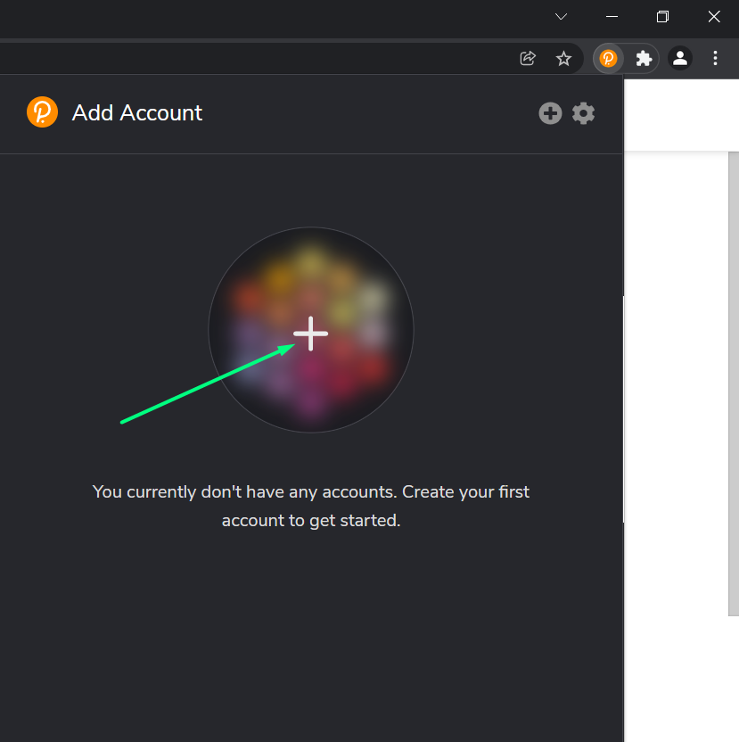
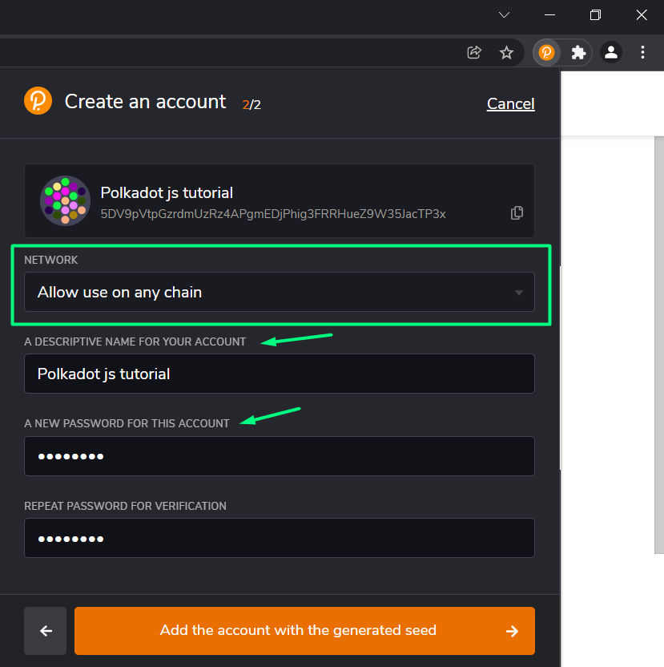
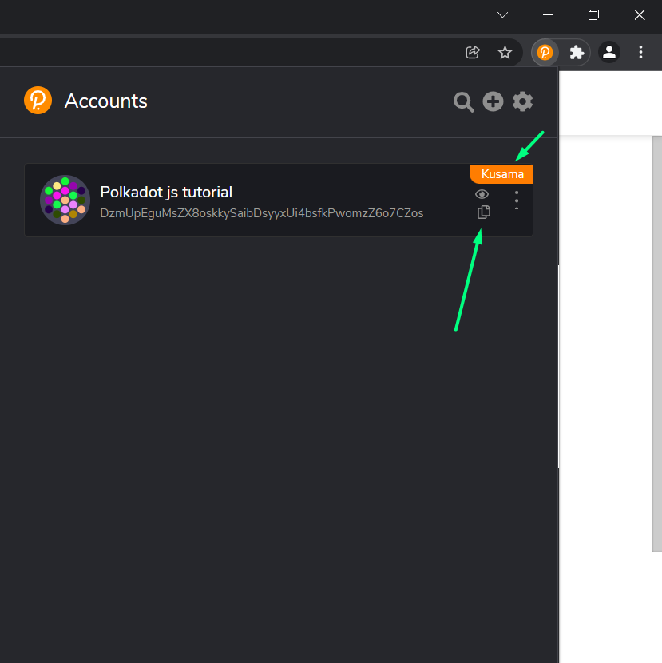

# How to create wallet

## How to create a wallet? 

- For start, we'll need to create a wallet which can store digital assets. Since we are in Polkadot/Kusama ecosystem, we'll be using polkadot.js wallet.

- We'll have 2 tutorials to choose from, either you can watch video tutorial in english on our youtube channel, or you can follow the step by step tutorial. The tutorial on youtube channel will be avalaible soon.

### Video tutorial
- 

### Step by step tutorial
- Go to https://polkadot.js.org/extension/
- According to your browser, select from the options

- You'll be redirected to your browser web store, where you add the extension to your browser.

- Click on "Add extension" and proceed

- In the right upper corner click on the extension shortcut and choose polkadot.js extension

- A pop-up window appears. Read the notes and continue by clicking on "Understand, let me continue". Keep the pop-up windown open to finish the process succesfully

- Click on the + button

- Almost there. Tick the box and continue to next step

::: warning 
The generated 12-word mnemonic seed is unique phrase, which only you have access to. Store it somewhere safe, it's overally recommended to store it on a paper on multiple places, online storing is not recommended. If you loose this device, you'll be able to restore your access to the wallet with the seed on a different device. Never share your seed phrase
:::

- We leave everything as it is, choose a descriptive name for the account and a password. Remember, the longer the password, the stronger it is

- Congratulations, you've succesfully created polkadot.js wallet! The shown address is a universal address for Polkadot/Kusama ecosystem. 

- By clicking on the three dots, window will show up, enabling you to choose different network. KodaDot is running on Kusama, so you might need your Kusama address if somebody asks you for that. 

::: tip
Sharing your address is completely fine, but keep in mind that all your transactions are visible on blockchain, by default. 
:::

- Yey! You've changed the network and you are running now on Kusama relay chain. Send ONLY KSM to this address as this is different from "allow to use on any chain"

- Enjoy your wallet. Learn how to top up your wallet [here](how_to_top_up_wallet.md)

