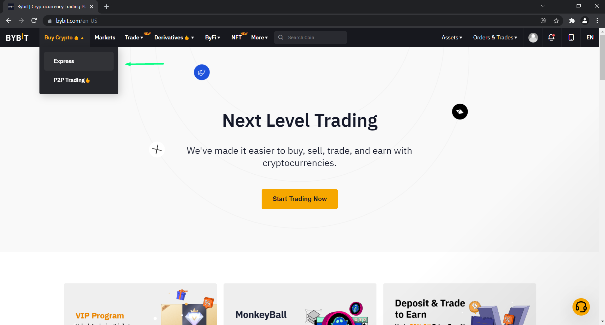
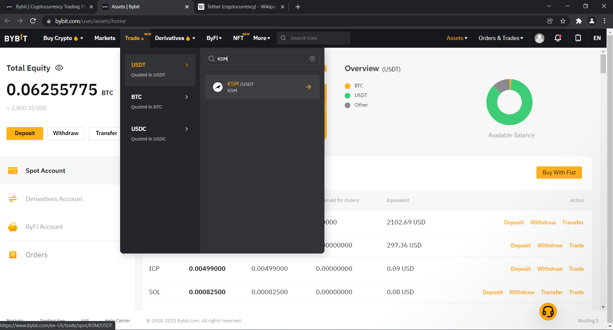
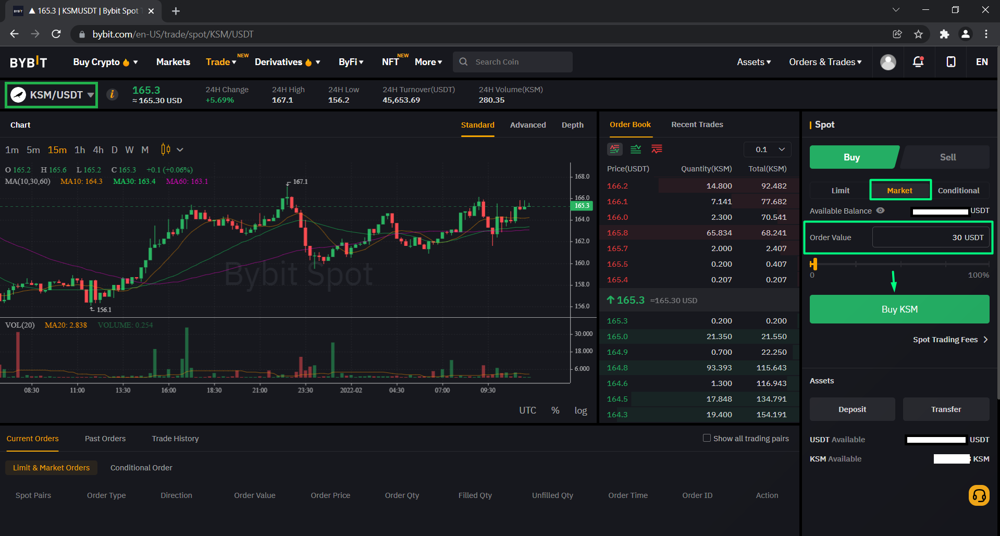
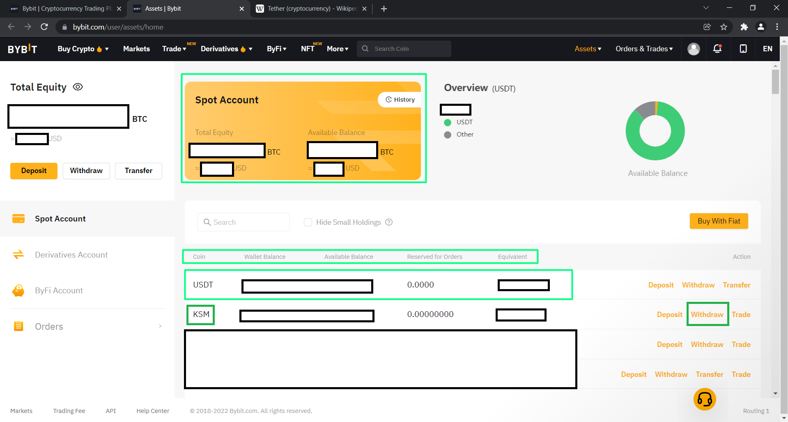
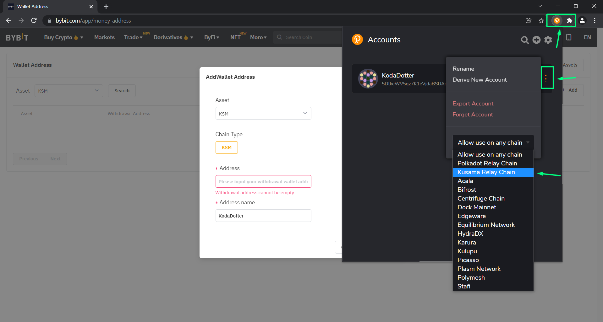
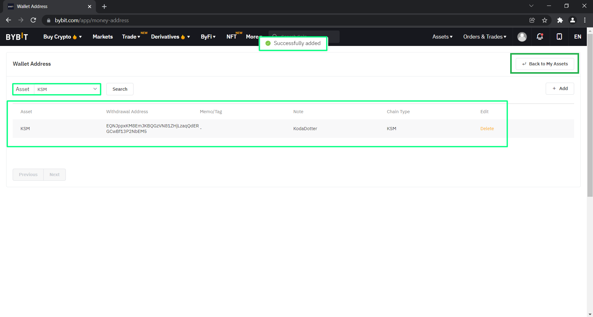
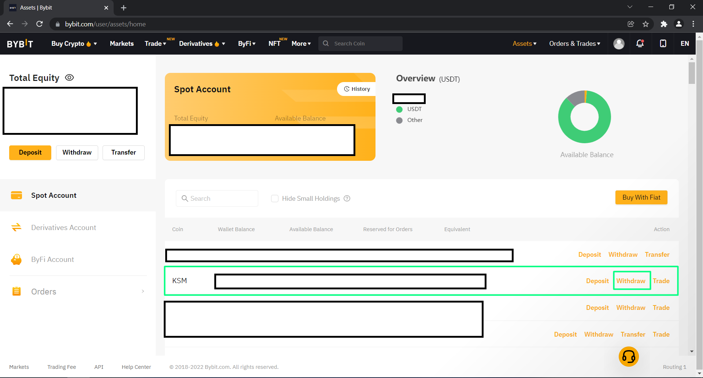
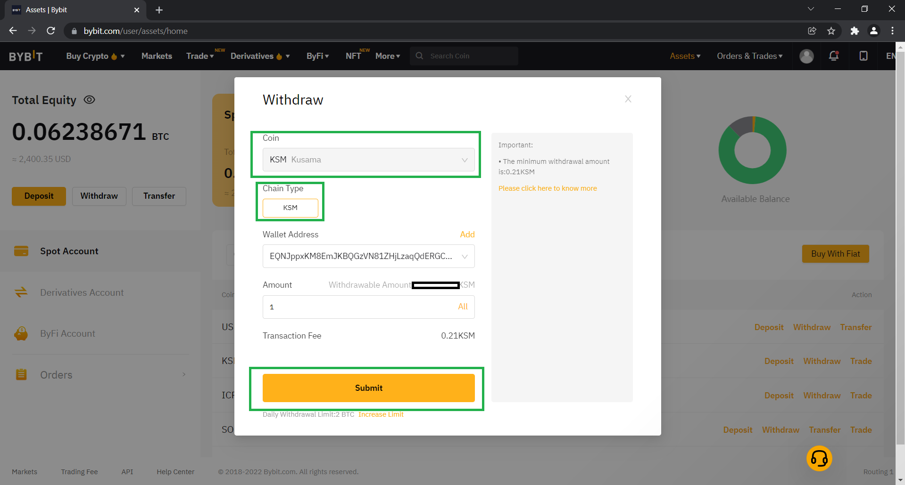

# How to top up my polkadot.js wallet

- First, you need to have [polkadot.js](https://polkadot.js.org/extension/) wallet installed. If you don't, check the tutorial on how to create the wallet [here](how_to_create_wallet.md).

## Options
- There are several ways how you can top up your wallet
    - [Ramp](https://ramp.network) network
    - Ask for a grant
    - Through centralized exchange like [Bybit](https://www.bybit.com/en-US/) or [Binance](https://www.binance.com/en) 

::: tip 
The process on most of the exchanges is very similliar. The most important thing is changing the network to KUSAMA Relay chain in the polkadot.js wallet and copying the address. [Learn](how_to_create_wallet.md) how to do it.
:::

### Top-up through [Ramp](https://ramp.network) network

- 

### Top-up through centralized exchange(withdrawal)
- For this tutorial, we've chosen to go with [Bybit](https://www.bybit.com/en-US/) but the process is usually the same. We recommend to store your digital assets on your wallet, as it's much safer.
- If you don't  have account on bybit, [follow this link](https://www.bybit.com/en-US/register) and create your account.
- Now, you can find yourself on the main landing bybit page. If you know how to purchase $KSM, but need help with withdrawal, skip a few steps.

#### Purchasing $KSM through centralized exchange from the beginning
- We are now on bybit landing page, select "Buy crypto" and click on "Express"

- This will take you to express purchase page and you need to fill this according to your needs. Click continue and proceed. You are buying USDT, which is [stablecoin](https://en.wikipedia.org/wiki/Stablecoin) which we will use to buy $KSM

- This will automatically take you to page of specific providers which you need to finish and once done, your balance in spot account will be visible in [USDT](https://en.wikipedia.org/wiki/Tether_(cryptocurrency))

- After you go through the process, your balance will be show in Spot account. Click on "Assets" and hit "Spot account"

- This takes you to your spot account overview, where you can overview your balances.

- Alright, now since we have some USDT, we can buy $KSM! :tada:
- Click on "Trade" choose "usdt" write in "KSM" and click on the ticker.

- This will take you to the exchange interface, automatically to the ticker you've chosen. On the right side, make sure you are in "Buy" column and choose "market"
- That will simply immediately without any prolonging market buy the cryptocurrency
- Input order value and click on Buy KSM

- Congratulations. Navigate yourself to the top as usually and click on "assets" and choose "spot account"

- This will take you to your classic overview where can you withdraw your purchased coins. Find KSM and in the same row click on "withdraw"

- A window shows up, you'll need to for safety add your address to address list. Click on "add"

- This takes you to address list, where you can add your address and keep it there for future withdrawals. Click on "add"

- It's important to keep in mind, that your polkadot.js wallet has the network set to Kusama Relay chain.
- Click on the extension icon, choose polkadot js, click on those 3 dots as shown on the picture and change the network to Kusama Relay chain. Now your address is prefixed for Kusama Relay chain. Send only $KSM to this address!

- Copy your address by clicking on the "copy" icon and make sure the network has changed

- You have your address from your polkadot.js wallet copied in clipboard. Paste it to the "Address" row, choose name and click on "continue"

- If you have 2FA enabled(recommended), input your 2FA code and click "continue" 

- You can now see your address in the list. Navigate yourself to the right upper corner, click on "Back to my assets" 

- Click on "withdraw"

- As coin, choose "Kusama" and chain type must always be KSM!
- Input your address from the list and choose amount
- Click submit.
- Next window will be confirmation of submitting your funds based on what security settings you have chosen. 

- :tada: You've succsefully withdrawn your coins.

