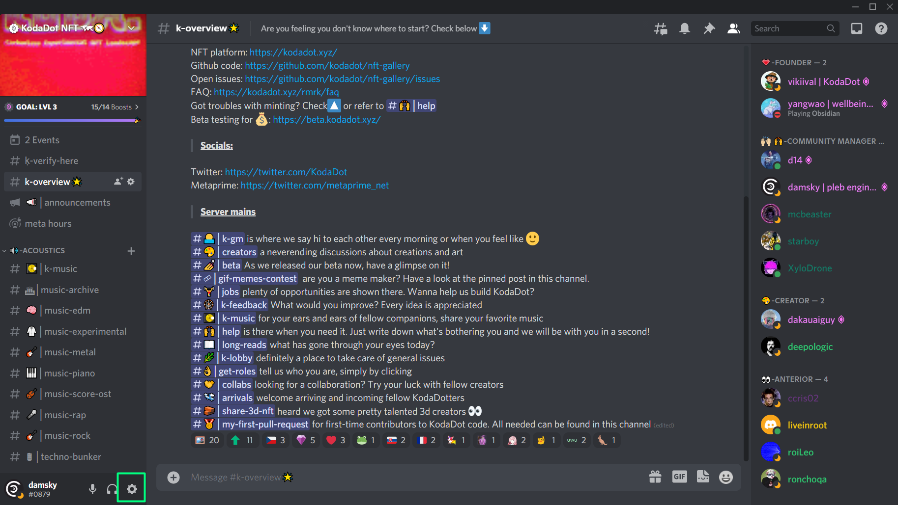
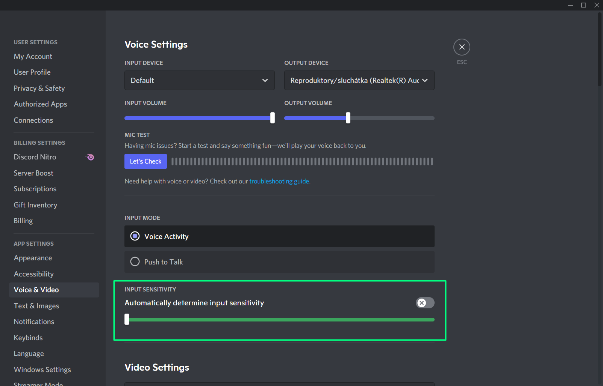

# Meta_Hours - bi-weekly digest of development progress 
- We are having bi-weekly updates from contributors to the KodaDot, including developers, community and creators to share insights on issues we've done, tackling issues, challenges and generally what's happening speaking on roadmap. 
- You can find summary of all of them at our [kodadot/nft-gallery/discussions under category Meta_Hours](https://github.com/kodadot/nft-gallery/discussions/categories/meta-hours)

### Recent Meta_Hours
- [Meta_Hours_5](https://github.com/kodadot/nft-gallery/discussions/2210)
- [Meta_Hours_4](https://github.com/kodadot/nft-gallery/discussions/2007)
- [Meta_Hours_3](https://github.com/kodadot/nft-gallery/discussions/1710)
- [Meta_Hours_2](https://github.com/kodadot/nft-gallery/discussions/1699)
- [Meta_Hours_1](https://github.com/kodadot/nft-gallery/discussions/1424)

### What to do before Meta_hours as a speaker
- Since there's always more users on the call, it's important to turn off sensitivity so your voice is stable and clean
- To do that, you have to go discord settings.

- Find voice & video

- Untick the "Input sensitivity" and make sure the slider is on the left

- :tada: You are ready to have a proper speech!