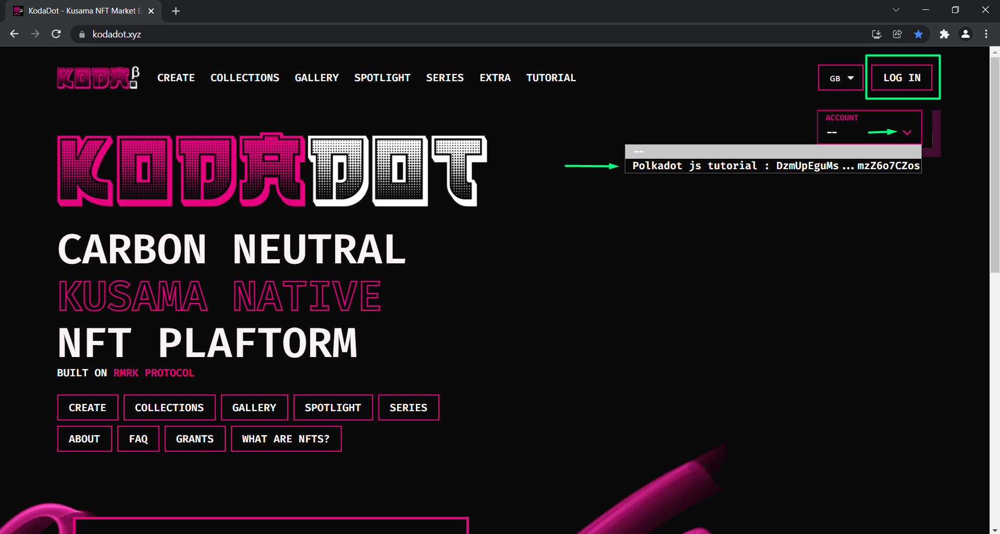
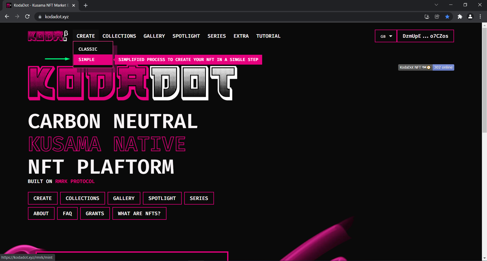
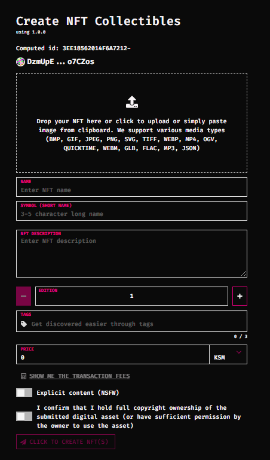
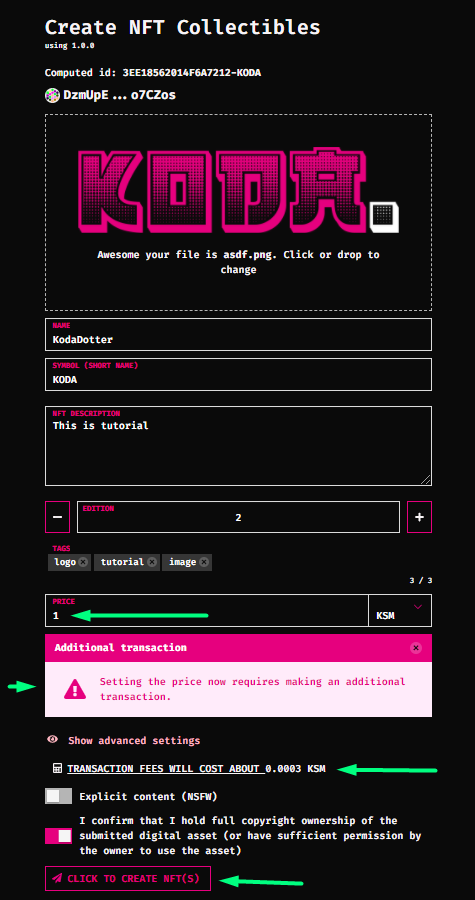
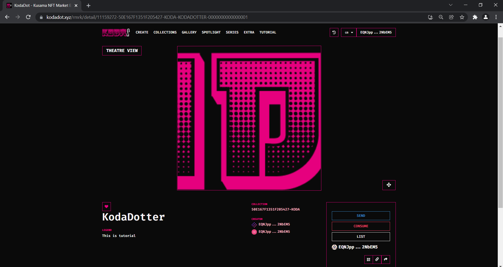
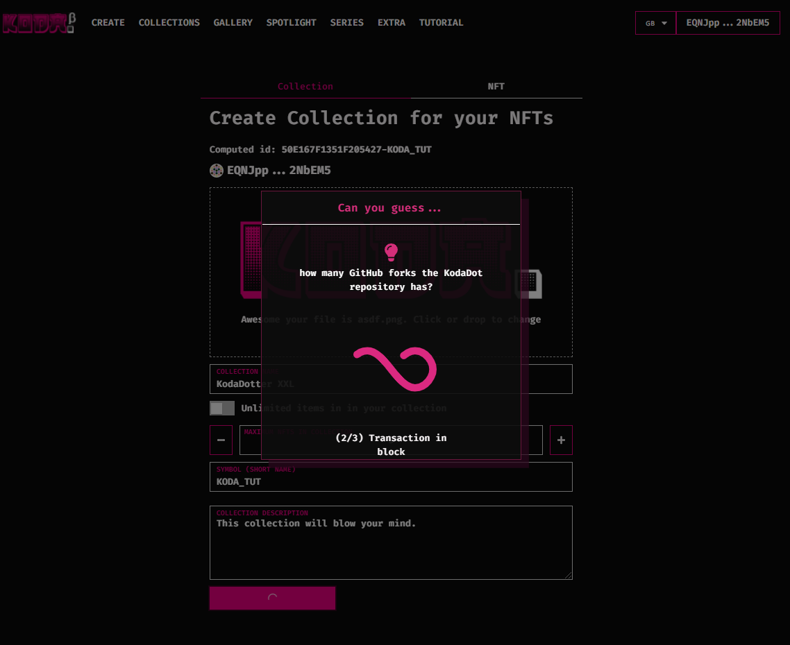
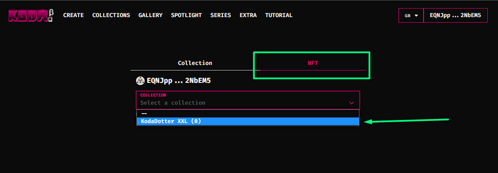
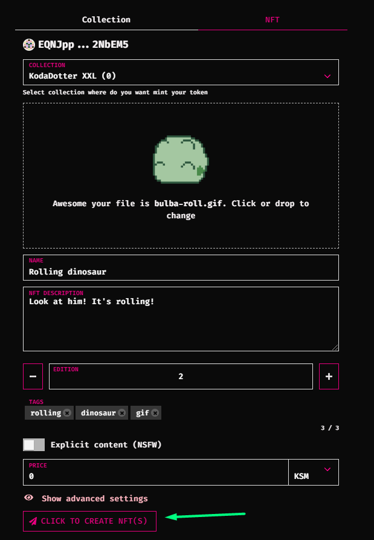

# Create your first mint
### Types of minting
- It's important to note, that on KodaDot there are mainly two minting methods that you can use. We are constantly evolving, so there might be some new methods added, but these two are constant.

### Simple mint
- Simple mint is the easiest way to create nfts. It's a simplified way to begin with, try the technology and look around a bit. Pretty good for from time to time minting, although if you are more of a creator and you want to have your own collection and more features, we recommend to go with Classic mint.
- Both are explained on this page. :muscle:
### Classic mint
- Classic mint however is a little more advanced approach to yourself aswell as to the technology. You start by creating collection first, where you state all the desired details and afterwards you are just adding NFTs to specific collections, according to your needs.

## How can i simple mint on KodaDot?
- First, you need your [polkadot.js](https://polkadot.js.org/extension/) wallet up and running in the browser extension. If you are struggling with this, we've made a [tutorial](how_to_create_wallet.md).
- Second step is easy, you need some [$KSM](https://www.coingecko.com/en/coins/kusama) balance. Since KodaDot is running on Kusama blockchain, micro fees are paid in the chain currency, which is $KSM. 
- Learn how to [top up your wallet](how_to_top_up_wallet.md).
- Once we have some ballance, let's get to minting! :tada: 
- Go to [KodaDot](https://kodadot.xyz/)
- You'll find yourself on our landing page, first, we should login with our polkadot.js wallet.
- Click on "log in" and choose the address you want to use. A polkadot js pop-up window might appear, click on "accept"

- You are now logged in.
- Navigate yourself to the left upper corner and click on "create". Choose "simple".

- You are now in the minting process! Congratulations.
- Fill all the details according to your needs.
- The number you state in "edition" will be the amount of copies you will recieve from this mint.
::: tip
If you want 1/1 art, just state "1" in edition.
:::

- Fill all the details and continue.

- If you choose to input price right away, you'll have to confirm two transactions.
- Transaction fees can be seen by clicking on the calculator icon. At the time of the tutorial it's about 0.05 $.

- Anytime throughout the mint you can change the details. As you can see, i've chosen to go with 1/1 edition and decided to choose the price later.
- Click on "Click to create NFT(S)"

- Input the password and sign the transaction.

- The transaction is now in block and your nft is being minted. :tada:

- Congratulations! Your nft has been minted and is ready to be worked with.
- "Send" will send it to someone.
- "Consume" will burn your nft.
- "List" makes you able to input the price and sell it.

- You have now successfully used simple mint.
- Are you ready for some advanced stuff? Let's dive in

## How can i use classic mint on KodaDot?

- First, you need your [polkadot.js](https://polkadot.js.org/extension/) wallet up and running in the browser extension. If you are struggling with this, we've made a [tutorial](how_to_create_wallet.md).
- Second step is easy, you need some [$KSM](https://www.coingecko.com/en/coins/kusama) balance. Since KodaDot is running on Kusama blockchain, micro fees are paid in the chain currency, which is $KSM. 
- Learn how to [top up your wallet](how_to_top_up_wallet.md).
- Once we have some ballance, let's get to minting! :tada: 
- Go to [KodaDot](https://kodadot.xyz/)
- You'll find yourself on our landing page, first, we should login with our polkadot.js wallet.
- Click on "log in" and choose the address you want to use. A polkadot js pop-up window might appear, click on "accept"

- You are now logged in.
- Navigate yourself to the left upper corner and click on "create". Choose "classic".

- You are now in the classic minting process! Congratulations. :tada:
- This is a bit more advanced way, where you create collection first and then add nfts to it. Proper creator stuff!

- Fill all the details
- If you want to have limited items in your collection, untick the pink box and choose amount
- Hit create collection

- Input your password and click "Sign the transaction"

- Transaction in block! :muscle:

- Once collection is created, you'll find yourself back on the same page. The only difference is, you have to choose "NFT"
- To verify your collection has been created, have a look in the dropdown menu and choose your collection
- The number in the brackets (  ) states how many nfts are in the collection 

- Proceed

- After your details are filled hit "click to create nft(s)
- Edition is number of copies of the selected art

- 

- 

- 

