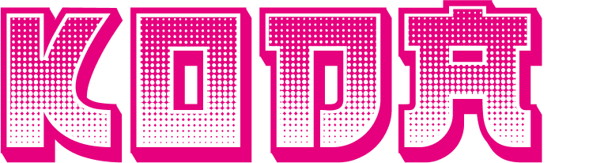

# Contributing as a Helper

## Looking to contribute to anything?
  You don't need to be technically or artisically inclined to contribute to KodaDot. We have many opportunities for those like you who want to change the open-source NFT marketplace. We believe one of the best ways to bring a community together is by bringing a challenge amongst themselves. This way, members either learn how to collaborate or innovate.

 We built KodaDot as an open-source community project. Everyone can contribute regardless of their technical ability and dedication. Choose what you're good at and get rewarded. We value high quality effort. Here's what you can do for us:

## Translating KodaDot

We are always innovating and reiterating, which means we must update our documentation as frequently and accurately as possible in all of KodaDot's available languages. We welcome new translations (i.e in another language) as well as updates to our previously existing translations!

If you'd like to contribute to KodaDot by translating our documentation in any way, please make sure you understand:

- **ALL** pull requests and commited changes must align with our [contribution guidelines](https://github.com/kodadot/nft-gallery/blob/main/CONTRIBUTING.md).

- Each contribution needs at least **TWO native-speaking reviewers in the language of the contribution**, otherwise your pull request won't be approved.

Read through our guide for [first-time contributors](https://github.com/kodadot/nft-gallery/blob/main/CONTRIBUTING.md) if you'd like more information. 

### Getting Started

We'll show you step-by-step on how to contribute to KodaDot by translating

1) Go to [KodaDot's Github Repository](https://github.com/kodadot/nft-gallery)
2) Go to the "langDir" folder and open it

3) Once you're in "nft-gallery/langDir/", go to the right upper corner and click on "Fork" - this is the codebase that you'll be able to make changes in 

**IMPORTANT:**
The "en.json" file is where the new updates (builds/additions) will be. If you're translating in another lanaguge, make sure what you're translating is up to date with the en.json file. You might come across previously translated parts when accessing your language. All you have to do is take what's translated, compare it with en.json, and translate what wasn't previously in your file. Your other option is to start your translation from scratch. 

4) Click on the "edit" icon to make changes. You can scroll through the file to see what hasn't been translated accurately or what hasn't been updated.

5) When you finish making changes, scroll until you see the "Commit Changes" box.
- If you're updating a previously existing translation, put "Update yourlanguage.json" (for example, "Update fr.json") 
- If you're adding a new language, put "Add mylanguage.json" (for example, "Add kr.json")

Then commit all the changes

:tada: Congratulations! You've submitted your change! 
All you have to do is wait for our approval

 ***Remember, you have to get TWO native-speaking reviewers to review your change***

In case you have any questions, don't hesitate and contact us on [discord](https://discord.gg/yzdWuFaY8W)!

### Rewards

$50-100 USD - Updating a previously existing translation (minor tweaks, significant upgrades, rephrasing etc.)
$150-300 USD - Translating a new language

## Catching Bugs

The main focus of our bug bounty program is to make sure the KodaDot's user experience goes as smoothly as possible. One of our goals is to hunt down possible bugs that may occur during KodaDot's constantly evolving platform.

### Submit a Bug Report
If you come across a bug, please use our [bug report form](https://github.com/kodadot/nft-gallery/issues/new?assignees=&labels=bug&template=bug.yml&title=Be+descriptive+and+short) on GitHub to report and detail your scenario while following the [Code of Conduct](https://github.com/kodadot/nft-gallery/blob/main/CODE_OF_CONDUCT.md).

If you find yourself on Github wanting to immediately report an issue, here's how you can through our [Repository](https://github.com/kodadot/nft-gallery):

#### 1) Go to 'nft-gallery'

#### 2) Click on 'Issues'

#### 3) Click on "New issue"

#### 4) Choose "Get Started" on the Bug Report option

#### 5) Fill out the boxes

**NOTE: The more thorough and detailed your bug reports are, the faster a developer can review it and reward you in $KSM. Collaborators and contributors have a say on the significance of the bug and whether or not it should be prioritized, which might affect the speed in which the bug is resolved.**

Feel free to ask in our Discord about the issue you submitted

### Rewards
We reward bounty hunters in $KSM. They can vary from $50 up to $600 depending on the severity of the bug. However, you can become disqualified if you don't follow the Code of Conduct.

## Quality Assurance

 To have way faster pace of development, as our current pace of **pull-requests was hitting 250 pull-requests in February on monthly average**, we've realized **we need more people to participate and to share with developers more humble and honest feedback on their work**. 

 Result would be that we could deliver user experience quality in shorter time window. 
 It's pretty natural that developers sometimes miss delivering the 100% specification in issue or something breaks. Happens and no need to make drama out of it. Everyone is learning.

 Till we have e2e tests complete on KodaDot, we would like to **happily reward your participation for your input on our pull-requests to codebase.**

 To participate, you must respect our code of conduct below

 ### Code of Conduct
 - Demonstrating empathy and kindness toward other people
 - Being respectful of differing opinions, viewpoints, and experiences
 - Giving and gracefully accepting constructive feedback
 - Accepting responsibility and apologizing to those affected by our mistakes, and learning from the experience
 - Focusing on what is best not just for us as individuals, but for the overall community

 You can read more about in our [CODE_OF_CONDUCT](https://github.com/kodadot/nft-gallery/blob/main/CODE_OF_CONDUCT.md)

 ### Rewards
 Once we are satisfied with your approach, we can **give you rewards for reviewing our pull-requests.** 

 This is still undergoing thought process and experiment to establish fixed amount of rewards for participation. 

 **Base range where we value your contribution is around $20-$50.** If there is opportunity you are technical contributor and you make origin pull-request suggestions what and why should be done other way, **the possibility raises up to $100.** 

 ### Reference
 - [What is Quality assurance?](https://en.wikipedia.org/wiki/Quality_assurance)

 ## Become an Ambassador

 Read more about [being an Ambassador of KodaDot](ambassador-program/ambassador-intro.md)

 ## Meta-Hours

 We have bi-weekly meetings with contributors of KodaDot to share each other's progress as well as future goals in our [Discord sever](https://discord.gg/kodadot). Before speaking, please make sure you're prepared as a [speaker](meta-hours.md). 

Is this your first time joining? Feel free to catch up on our [past Meta_Hours](https://github.com/kodadot/nft-gallery/discussions/categories/meta-hours)! 