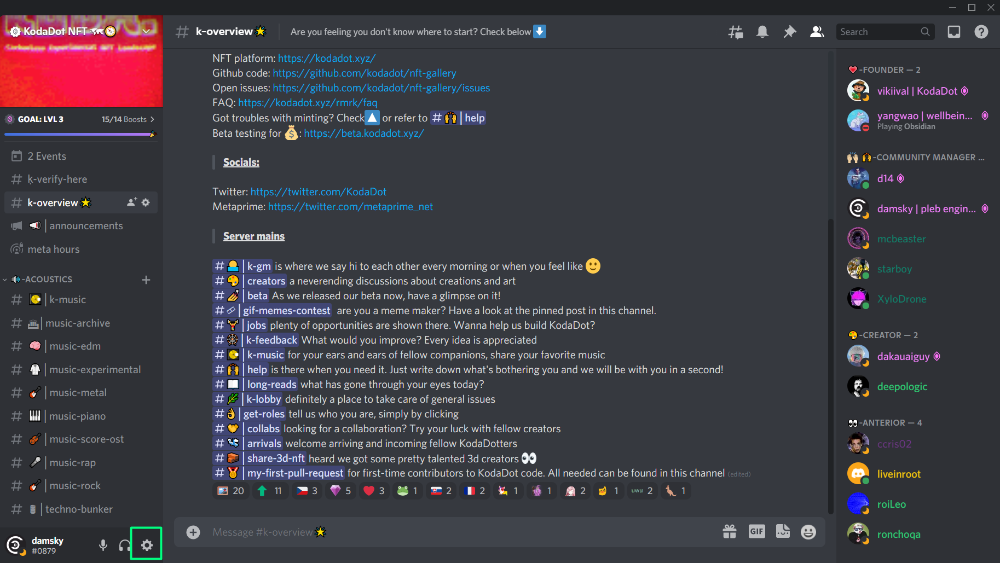
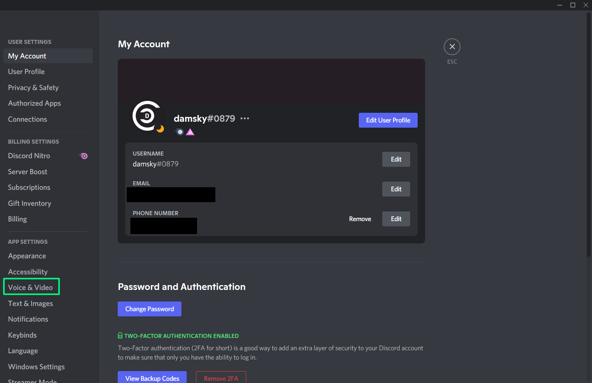
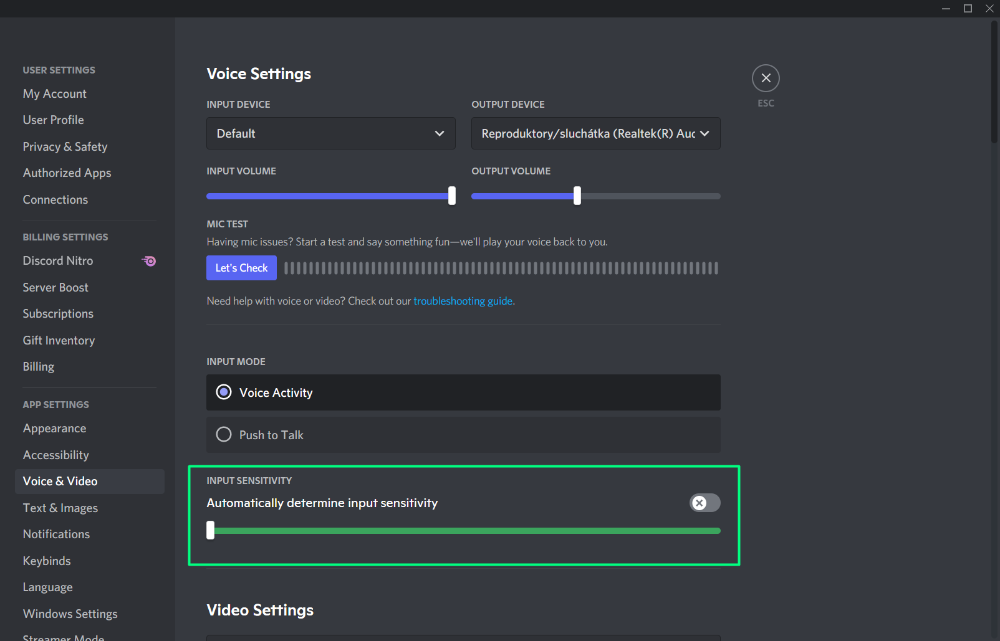

# Speaking at Meta_hours!
## What to do before Meta_hours as a speaker
When coming to Meta_hours, it's important to make sure that you come with a clear and stable connection to allow the community to clearly hear you. Here's how:

### Step 1: Go to Discord settings

### Step 2: Find the "Voice & Video" tab

### Step 3: Untick the "Input sensitivity" box and make sure the slider is on the FAR left

Congratulations :tada: You are ready to speak!

